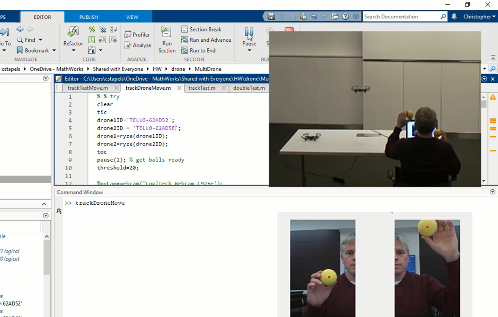

# Flying multiple drones assisted by webcam tracking in MATLAB&reg;

Now in MATLAB you can control multiple Ryze Tello&reg; drones at once. The connectivity capabilities and ease of writing code in MATLAB allows you to quickly develop different control mechanisms.  In this code, you use webcam images to track balls held in hand. Drone takeoff, land, and move (in a 2d plane) are handled based on the position of the ball in the image frame.
You will need two Ryze Tello EDU drones setup in station mode, an external WiFi router and some distinctly colored balls.  You can set the color of the ball in myTrackballC.m 

# Setup

Watch the [video](https://www.mathworks.com/videos/control-multiple-ryze-tello-edu-drones-in-matlab-1646374241250.html) for additional information about how to use this code.

## MathWorks Products (http://www.mathworks.com)
Requires MATLAB release R2020b or newer

[Ryze Tello Drone Support Package]https://www.mathworks.com/hardware-support/tello-drone-matlab.html

## License

The license for this module is available in the LICENSE.TXT file in this GitHub repository.

## Community Support

[MATLAB Central](https://www.mathworks.com/matlabcentral)
Copyright 2022 The MathWorks, Inc.

